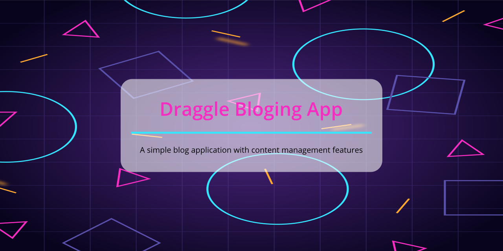

# draggle-blog



[](https://github.com/RichardLitt/standard-readme)

> This is a blog application. I use django for making this app.

TODO: Fill out this long description.

## Table of Contents

- [draggle-blog](#draggle-blog)
  - [Table of Contents](#table-of-contents)
  - [Background](#background)
  - [Install](#install)
  - [Usage](#usage)
  - [Maintainers](#maintainers)
  - [License](#license)

## Background
Tech stacks used for this application
- Python 3.7
- Django 2.2
- Materialize css
  
## Install
First of all you have to install pipenv
```shell
pip install pipenv
```
Then open terminal in the project directory and run this command
```shell
cd src/
python manage.py makemigrations
python manage.py migrate
python manage.py runserver
```

## Usage
Goto localhost
```
http://127.0.0.1:8000/
```

## Maintainers

[@Dipto Karmakar](https://github.com/dipto0321)


## License

MIT © 2019 Dipto Karmakar
